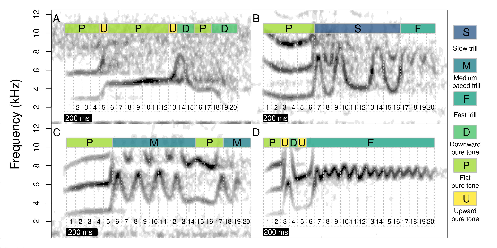

```{r, fixing citation .bib files, eval = TRUE, echo = FALSE, message = FALSE, warning=FALSE}

# how to cite in Rmarkdown
# https://rmarkdown.rstudio.com/authoring_bibliographies_and_citations.html

# update the copy of my citation library when compiling Rmarkdown #############
# personal_libraries <- c(author1 = "path/and/name/of/.bib/file/from/author1", author3 = "path/and/name/of/.bib/file/from/author2", author3 = "path/and/name/of/.bib/file/from/author3")

personal_libraries <- c(author_1 = "/home/m/Documentos/library.bib", author_2 = "/media/bwillink/HD710\ PRO/Investigacion/lbh_cultural_evolution/manuscript/CultEvolBeti.bib")


# update bibtex library
for (i in 1:length(personal_libraries))
# if (file.exists(personal_libraries[i]))
 file.copy(from = personal_libraries[i], to = file.path(getwd(), "manuscript", paste0( names(personal_libraries)[i], ".bib")), overwrite = TRUE)

#############################################################

# combine .bib files in compiled.bib
bibs <- list.files(pattern = ".bib$")

bibs <- bibs[grep("author", bibs)]

if (length(bibs) > 0){
  combined_bibs_l <- lapply(bibs, readLines)
  
  names(combined_bibs_l) <- gsub("\\.bib$", "", bibs)
  
  # remove empty ones
  combined_bibs_l <- combined_bibs_l[!sapply(combined_bibs_l, function(x) x[1] == "\xfe\xff")]
}

#####################
# # add author name to references NOT WORKING
# last.field <- "pages"
# 
# combined_bibs_l <- lapply(names(combined_bibs_l), function(x){
# 
#   combined_bibs_l[[x]][grepl(pattern = paste0("^", last.field, " = "), combined_bibs_l[[x]])] <- gsub("\\}\\,$", paste0("_", toupper(x), "},"),
#            combined_bibs_l[[x]][grepl(pattern = paste0("^", last.field, " = "), combined_bibs_l[[x]])]                                                                        )
# 
#   return(combined_bibs_l[[x]])
# })
# 
# 
# last.field <- "volume"
# names(combined_bibs_l) <- gsub("\\.bib$", "", bibs)
# 
# combined_bibs_l <- lapply(names(combined_bibs_l), function(x){
# 
#   combined_bibs_l[[x]][grepl(pattern = paste0("^", last.field, " = "), combined_bibs_l[[x]])] <- gsub("\\}\\,$", paste0("X", toupper(x), "},"),
#            combined_bibs_l[[x]][grepl(pattern = paste0("^", last.field, " = "), combined_bibs_l[[x]])]                                                                        )
# 
#   return(combined_bibs_l[[x]])
# })
####################

# combine bibs in a single one
combined_bibs <- unlist(combined_bibs_l)

writeLines(text = combined_bibs, "combined_bibs.bib")

keys <- grep("@article{", combined_bibs, fixed = TRUE, value = TRUE)
keys <- gsub("@article{", "", keys, fixed = TRUE)
keys <- gsub(",", "", keys, fixed = TRUE)

tab_keys <- table(keys)

if (anyDuplicated(keys)){
  print(paste0(sum(tab_keys > 1), " duplicate(s) references found in combined_bibs.bib"))
# print(paste0("This are the keys of those references: ", paste(names(tab_keys[tab_keys > 1]), collapse = "|")))
}

# additional packages and data
# install.packages("english")
library(english)
library(warbleR)
library(viridis)

segments_by_song_type <- read.csv("../data/raw/segments_by_song_type.csv")

knitr::opts_chunk$set(message = FALSE, warning = FALSE) 


```

^1^ Centro de Investigación en Neurociencias, Universidad de Costa Rica

^2^ Lab of Ornithology, Cornell University

^3^ School of Biology, University of Costa Rica

^4^ Department of Biology, Stockholm University

^5^ Department of Biology, University of Washington

\*To whom correspondence should be addressed

**Keywords:** cultural evolution, bla, bla, bla, bla
---

<!-- Ideas pal titulo: -->
<!-- Understanding cultural evolution in hummingbird leks through the fossilized birth-death process -->

<!-- An application of the fossilized birth-death process to elucidate cultural evolution in hummingbird leks -->

<!-- The fossilized birth-death process illuminates cultural evolution in hummingbird leks -->

<!-- The fossilized birth-death process illuminates song cultural evolution in a hummingbird -->

## Abstract


## Introduction

<!-- Big question: Is cultural evolution really analogous to organic evolution?  -->
The idea that socially transmitted behaviours change and diversify over time in a manner analogous to organic evolution and phylogenetic diversification can be traced back to Darwin, who noted that “the formation of different languages and of distinct species, and the proofs that both have been developed through a gradual process, are curiously parallel” [@Darwin1871]. The term culture can be used broadly to refer to socially transmitted information that influences behavioural patterns within animal groups [@laland2003animals]. While human language, beliefs, norms and material artefacts are well-known cultural domains, many forms of culture exist among diverse animals, such as vocal dialects [@catchpole2003bird; @Aplin2019], navigation routes [@laland1997shoaling; @jesmer2018ungulate], and tool use [@whiten2005conformity; @luncz2014tradition]. After the Modern Synthesis, the formal modelling of cultural change as evolution, whether in humans or non-human animals, became possible by drawing analogies between cultural and population genetic processes [@cavalli1981cultural; @boyd1985culture]. For instance, imperfect imitation could be compared to genetic mutation [@kempe2012experimental], biased transmission to natural selection [@williams2013three] and random fluctuations in the frequency of traditions to genetic drift [@bentley2004random]. However, unlike genetic evolution, in which the most fundamental units of transmission (nucleotides) are essentially universal, cultural evolution implies disparate units of transmission across taxa and in different social contexts (e.g. tools vs. songs). To properly address the long-standing question of whether cultural change over time is truly akin to evolution, we require means to systematically assess the power of evolutionary methods, across the great variety of cultural forms that have emerged across the animal kingdom [@mesoudi2017pursuing].

<!-- We can study the cultural evolution of behavioural sequences with phylogenetic tools, maybe. -->
Some behaviours can be described as sequences of ethological units. For example, visual displays can be encoded as a string of stereotyped motor patterns [@Araya-Salas2019; @Ligon2018] and bird and whale songs are typically structured as sequences of repeated and hierarchically nested sounds [@Rivera-Caceres2016; @Kershenbaum2014b; @payne1971songs; @garland2017song]. Encoding behaviour as a sequence can facilitate the adoption of phylogenetic approaches that take molecular data as their main input. Such approaches have been developed within a strong theoretical framework that continues to grow and increasingly accommodates biological realism [@yang2012molecular]. Substitution models applied to molecular sequence evolution are routinely combined with clock models and tree priors, such as the birth-death process, to understand the temporal dynamics of lineage diversification and turnover [@morlon2014phylogenetic; @bromham2018bayesian] Analogously, clock models, tree priors and substitution models may be used to elucidate the temporal dynamics of cultural diversification, when culture can be adequately modeled as behavioural sequences composed of discrete units. However, most phylogenetic models assume that once diverged, lineages evolve independently of one another, branching in a tree-like pattern. As in organisms with extensive hybridization and horizontal gene transfer [@philippe2003horizontal; @bapteste2013networks], this assumption may be often violated in cultural evolution, because learning from same-cohort individuals should increase the potential for reticulate evolution [@gray2007pleasures]. Empirical knowledge on the robustness of classic phylogenetic models to horizontal transmission of culture [e.g. @collard2006branching], and more generally the absolute fit of such models models to cultural data, is thus crucial in addressing the utility of phylogenetic approaches to study the cultural diversification of socially learnt behaviours.  <!-- should we mention non-bayesian methods as well? or at least keep it more general? Beti: I removed the mention of Bayesian implementation. In a general sense, all of this applies to any likelihood based model, whether, ML or Bayesian, although I believe for the specific stuff we are doing there is no available ML implementation -->

<!-- Sequence alignment is another huge challenge for cultural phylogenetics. -->
Cultural evolution poses further challenges to the application of phylogenetic models. Most implementations of phylogenetic models on molecular data start with a sequence alignment. Alignments represent assumptions of homology between characters in matched positions along a sequence, but are typically treated as observations for phylogenetic inference [@lutzoni2000integrating; @redelings2005joint; @lunter2005bayesian]. Numerous methods of sequence alignment have therefore been developed to capture the main features of molecular evolution, and in some cases to explicitly model mutation events [@yang2012molecular; @chatzou2016multiple]. Nonetheless, the accurate reconstruction of homology in sequence alignments is a pervasive challenge in molecular phylogenetics [@warnow2021revisiting], that is only exacerbated when borrowing phylogenetic tools for the study of behavioural sequences [@caetano2020comparative]. We clearly have a better understanding of the basic rules that govern the rates of different nucleotide substitutions than we do for changes in the dance moves of a courtship display or changes in the sequence of sounds of a mating vocalization. A crucial question for the nascent field of cultural phylogenetics [sensu @mesoudi2017pursuing] is therefore whether alignment algorithms developed for molecular data can be suitably modified to represent the processes behind cultural change and diversification.

<!-- Fast-paced cultural change provides opportunities for cultural phylogenetics. -->
Despite these challenges, culture also poses unmatched opportunities for the application of phylogenetic inference. Culture can change very rapidly in comparison to molecular evolution [@perreault2012pace], allowing researchers to document multiple lineage diversification events as they occur and during the span of one or a few academic lifetimes. Cultural phylogenetics can therefore capitalize on a relatively rich historical record, that markedly contrasts the sparse fossil record of many organismal groups [@kidwell2002quality]. Recently developed phylogenetic methods have shown that sampling ancestors of extant taxa and explicitly incorporating these data in the diversification process allow for more accurate estimation of divergence times [@gavryushkina2014bayesian; @zhang2016total; @gavryushkina2017bayesian]. This is accomplished by the fossilized birth-death process (FBDP) [@heath2014fossilized; @gavryushkina2014bayesian], a model that jointly describes the probabilities of lineage splitting, extinction and fossilization that give rise to the sampled taxa, whether extant or fossil. Of course, the fossilization rate estimated in the FBDP may represent actual fossilization events, but can also be used to describe serially sampled viral strains [@stadler2013dating; @gavryushkina2014bayesian], or, as in this case, historical records of behavioural patterns that are socially learnt and transmitted [@ritchie2019influence; @zhang2020dated; @rama2018three]. Thus, when culture evolves rapidly and learnt behaviours are sampled serially, a vast record of ancestral lineages can bolster inferences of cultural diversification dynamics through the FBDP.

<!-- Untapped potential of FBDP in cultural phylogenetics. -->
Cultural phylogenetics research that builds on Bayesian estimation of origination, extinction and preservation rates is recently growing, but remains restricted to specific domains of human culture [@gjesfjeld2016competition; @gjesfjeld2020quantitative; @ritchie2019influence; @zhang2020dated; @rama2018three; @sagart2019dated]. Studies applying the FBDP in particular have been focused on elucidating the history of diverse human language families [@zhang2020dated; @rama2018three; @sagart2019dated]. Thus, a great untapped potential remains for investigating cultural diversification in non-human animals and to address whether the analogy between organic evolution and cultural change holds for disparate cultural phenomena. Although ambitious, this goal is facilitated by the increasing use of quantitative methods in animal behaviour [@Egnor2016], particularly in bioacustics [@Odom2021; @Keen2021]. <!--ask MAS if true, elaborate and Ref-->     

<!-- Long-billed hermits are great study organisms for cultural phylogenetics.  -->
<!-- For MAS -->
Animal vocalizations are sequences of varying frequency patterns through time, which simplifies the use of phylogenetic reconstruction models based on sequence alignment for modeling their cultural evolution. The song of the long-billed hermit hummingbird provides a particularly useful system for this purpose. Compelling evidence supports the occurrence of social vocal production learning in this species [@TenCate2021a], including micro-geographic song variation decoupled from genetic structure [@Araya-Salas2019] and adult replacement of crystallized songs [@Araya-Salas2013]. In addition, several behavioural and natural history attributes facilitate the study of their song's cultural evolution. The song consists of a trace of frequency through time on the spectrogram (i.e. a single song type [@Araya-Salas2019]) which can be represented as a sequence of discrete sounds fused together into an unbroken signal (detailed in 'Methods'). Indeed, the most salient differences among song types resides in the composition and sequential order of their sounds [@Araya-Salas2013]. Males sing a single song type repertoire, which enable comparing songs from different individuals as homologous traits (as opposed to multiple song-type repertoires). Males form leks of 5-20 individuals [@stiles-wolf1979] separated by approximately 1 Km from other leks. Song types can be shared by sub-groups of individuals within leks, with no evidence of song type sharing across leks [@Araya-Salas2019], suggesting leks operate as relatively isolated cultural systems. Finally, males are highly vocal through the 8-month long breeding season, which facilitates the registering of a lek's song type pool and thus is longitudinal monitoring.   

<!-- For BW This means we can use lbh leks to “replay the tape of evolution”
-->

<!-- Specific questions that we address in this study. -->
Here, we make use of a rich five-decade long song data set of long-billed hermit songs from five leks to model cultural diversification using the FBDP. We then investigated model reliability and absolute fit using posterior predictive simulation, comparing features of empirical song sequences to sequences generated by models under the FBDP. We further asked how biologically informed assumptions during sequence alignment impact model reliability and estimates of diversification dynamics. Finally, we explored how the use and completeness of historical records (analogous to fossil records) affect model reliability and the fit of alternative clock models to long-billed hermit song data. The results will bring insight into the adequacy of historically informed phylogenetic inference models for reconstructing cultural divergence processes in non-human animal systems. By taking full advantage of the historical record under an explicit evolutionary model, the resulting cultural phylogenetic hypothesis might provide a more robust platform to understanding the patterns and processes of evolution in these systems.  <!-- a couple of sentences on the punch and relevance of our results -->

## Methods

    - Data collection (MAS)

Sound recordings of long-billed hermit songs were registered from 2008 to 2019 at four sites in the caribbean slope of Costa Rica: La Selva Biological Station (leks SUR and CCE), Finca las Brisas (BR1), Hitoy Cerere Biological Reserve (HC1) and La Tirimbina Lodge (TR1). We also included recordings from the 1960'-70'-80's for the two leks at La Selva [@stiles-wolf1979] and from 1990's for HC1. Recordings were gathered with different equipment at different points in time (i.e. shotgun or parabolic microphones, analog or digital recorders). Nonetheless, the spectrographic structure of the signals (used for determining signal structure, see below) is not affected by the recording equipment in a significant manner. The most noticeable effect of differences in recording equipment can be a slight time distortion (expansion or contraction) when using analogous recordings. However, the approach used for coding song structure (explained below) as sequences is not affected by song duration (i.e. a time-expanded song would produce exactly the same song sequence as its original form).

    - Song structure coding (MAS)
Long-billed hermit songs are composed of two basic type of sounds: pure tones and trills (Fig. 1). Pure tones can vary in the degree of modulation (i.e. changes in frequency through time) while trills vary in the number of oscillations per unit of time (i.e. rate). We subdivided these two basic sound types into six categories (Fig. 1): slow trill, medium-paced trill, fast trill, downward pure tone, upward pure tone and flat pure tone. Song were split into 20 equal-length segments and each segment was assigned to one of these six categories (Fig. 1).  

```{r echo=FALSE, out.width='100%', fig.cap= "Fig 1. "}



```

### Sequence alignment (BW)

Alignment of behavioural sequences is complicated by the challenge of establishing homology between ethological segments or units [@caetano2020comparative]. Here, we implemented and compared three alignment strategies based on two methods originally developed for multiple sequence alignment (MSA) of molecular data. In alignments of nucleotide and protein sequences gaps represent insertion or deletion mutations, so that characters at gapped sites lack homology across the dataset. Commonly used MSA methods differ in their treatment of insertion and deletion events in ways that can impact homology inferences in cultural as well as in molecular characters [@Loeytynoja2012]. MAFFT [@katoh2013mafft; @katoh2002mafft] uses a progressive alignment algorithm with a default gap-opening penalty (1.53) and no gap extension penalty by default, in versions > 6.626. The L-INS-i method follows the progressive alignment by iterative refinement, based on consistency and weighted sum-of-pairs scores. In MAFFT versions > 7.371 user-defined alphabets and scoring matrices can be implemented in addition of nucleotide and amino acid alternatives. MAFFT is therefore a flexible program to align behavioural sequences in which changes analogous to multi-site insertions and deletions have occurred, and which are composed by a variable number of character states and character-state categories. In our first alignment strategy, which we hereafter refer to as ‘MAFFT-agnostic’, we used the MAFFT L-INS-i method with default gap penalties and a customized scoring matrix in which all transitions between alternative character states were equally likely.

Our second alignment strategy also used the MAFFT L-INS-i method and default gap penalties, but we made the assumption that when long-billed hermits modify pre-existing songs they are more likely to replace a trill by a different type of trill and a tone by a different type of tone than to change from trills to pure tones or vice versa. This seems more biologically meaningful as different biomechanics are involved in producing trills and pure tones [@Elemans2007]. We implemented this assumption by enforcing a higher cost of mismatches between sound categories than within either trills or pure tones. To determine an appropriate difference in mismatch scores, we made use of previously documented pattern of higher song similarity within lek than between leks [@Araya-Salas2019] and the observation of no song type sharing among four leks in close proximity during a ten year period (M.A.S. pers. obs.), suggesting little cultural transmission across leks. <!-- add (see Limitations section)?-->. ~~Because insertions and deletions of song segments occur independently among individuals~~ <!-- not sure if true, an alternative process is that insertions/deletions occur in 1 individual and then spreads from there-->~~,~~ Alignment length should increase as sequences are more distantly related [@Loeytynoja2012]. We would thus expect longer alignments in data sets composed of song sequences from different leks than in data sets composed of sequences from the same lek, as these sequences have a more recent common ancestor. Following this logic, we selected mismatch scores for substitutions within and between sound categories (trill vs. pure tone) that maximize the alignment length for pools of sequences from different leks relative to the alignment length sequences originating from the same lek, using a data set of 184 song sequences from 12 leks. We hereafter refer to this alignment strategy as ‘MAFFT-optimal’.

For our third alignment strategy, we used the phylogenetically informed alignment program PRANK [@loytynoja2005algorithm; @loytynoja2008phylogeny]. PRANK also uses a progressive algorithm but handles the placement of insertions and deletions differently, by using outgroup information in the subsequent alignment step. PRANK thus uses the sequence phylogeny to differentiate insertions from deletions, and thereby avoids site overmatching by penalizing insertions in a single stage of the alignment [@loytynoja2005algorithm]. Unlike MAFFT, PRANK is an evolutionary aware program in that insertions, deletions and substitutions are modelled explicitly on a phylogenetic tree. However, PRANK does not currently support customized alphabets and substitution-rate matrices. To use PRANK we assumed that pure tones can be treated as ambiguous between upward and downward tones, and medium-paced trills can similarly be treated and ambiguous between fast and slow trills. We therefore used IUPAC ambiguity code for DNA nucleotides to rename song segments, with tones as purines and trills as pyrimidines. As per PRANK’s defaults we used a TN93 nucleotide substitution model with empirical base frequencies and transition/transversion rate ratio (κ) = 2. Therefore, as in the ‘MAFFT-optimal’ alignment, in the ‘PRANK-TN93’ alignment we explicitly assumed a higher transition rate within vibratory and pure sound categories than between them. For this alignment we used the default gap-opening rate and extension probabilities (0.025 and 0.75 respectively) and we omitted the -F option that fixes inferred insertions but increases sensitivity to guide-tree accuracy.
  

### Phylogenetic analysis (BW)

All phylogenetic analyses were conducted in RevBayes v. 1.0.12 and v. 1.1.0, a computation environment that uses probabilistic graphical models for Bayesian inferences in phylogenetics and evolution [@hohna2016revbayes]. Our phylogenetic model was a fossilized birth-death process (FBDP) which describes the joint prior distribution of the tree topology, divergence times and lineage sampling times before the present [@heath2014fossilized]. In the FBDP, extant taxa and lineages sampled before the present are part of the same macroevolutionary process. For many applications of the FBDP, extinct or ancestral taxa can only be sampled through fossils. However, in the case of fast-evolving songs that are culturally transmitted among individuals, historical records of songs are equivalent to fossil data. Historical records contain the character sequences of songs that existed in the past and may be ancestral to extant songs or may have gone extinct. As in the FBDP with fossil data, the probability that a historical song is an ancestor of extant songs depends on the rates of lineage turnover and the rate of recovery of historical records (hereafter recovery rate). The recovery rate is the rate at which ancestral songs are sampled from the lineage diversification process and it is a random variable drawn from a prior distribution, such as the birth and death rates of a traditional birth-death model. Sampling ancestors as part of the same evolutionary process as we have done here improves estimation of diversification and clock rates [@gavryushkina2014bayesian] and sampling character data from ancestors further improves estimates of divergence times in simulated data [@luo2020simulation].

Our dataset on historical records of songs in hummingbird leks has three advantages in comparison to most fossil datasets used in phylogenetic analyses. First, there is no stratigraphic uncertainty. We can be certain that historical songs occurred in the year when they were recorded. Second, there are no partial fossils. Songs recorded in the past are just as complete as the most recent ones, creating no additional ambiguity in character states of historical songs. Third, the historical record is relatively rich. In all leks, there are multiple years sampled consecutively and in two leks (SUR and CCE) historical records go back to 1969 (Fig. 1d). Because leks are small, long-billed hermits are constantly singing throughout the day and just a few seconds of recording are neccesary to fully register their single song-type repertoire, we can assume detection is nearly perfect and thus there little or no missing taxa in any of the sampled years.

```{r load-packages, message=FALSE, results='hide', eval=TRUE, echo=FALSE, warning=FALSE, message=FALSE}
x <-
  c(
    "tidyr",
    "ggplot2",
    "viridis",
    "coda",
    "treeio",
    "phytools",
    "plyr", 
    "kableExtra"
  )

lapply(x, function(y) {
  # check if installed, if not install
  if (!y %in% installed.packages()[, "Package"])
    install.packages(y)
  
  # load package
  try(require(y, character.only = T), silent = T)
})
```

```{r, echo=FALSE}
fs <- read.csv("../data/processed/fossil_series.csv", header = T, sep = ",")

require(ggplot2)
require(viridis)

pal <- viridis(10)

ggplot(fs, aes(Year, Lek)) +
  geom_tile(colour = NA, aes(fill = Sampled)) +
  scale_fill_gradient(low = "white",
                      high = pal[7],
                      breaks = seq(0, 1, 1)) +
  theme_bw(base_size = 12) +
  theme(panel.grid.major.x = element_blank()) +
  theme(panel.grid.major.y  = element_blank()) +
  theme(legend.position = "none") +
  labs(title = "d)")  + theme(plot.title = element_text(face = "bold")) +
  theme(plot.title.position = "plot")
```

<!--this is my proposal for fig 1, we can put it elsewhere, but I though about it when I was here--> 
**Figure S1. **Historical sampling of socially transmitted songs from five long-billed hermit leks. Years when songs were recorded are marked in colour.

A possible complication in our analysis is that long gaps without sampling are interspaced in the three leks with deeper historical records (HC1, CCE and SUR). However, the temporal distribution of these ancestral samples is not unlike that of fossils, which are typically aggregated in discrete strata of exposed rocks [@holland2016non]. The FBDP is robust to some forms of bias in fossil sampling, including non-continuous recovery [@heath2014fossilized]. Nonetheless to better understand the effects of deep, yet discontinuous historical sampling we conducted all analyses for these leks both with the complete dataset, including long gaps without lineage sampling, and with the more recent and continuously sampled dataset. We present both sets of results for comparison. Finally, to investigate the general impact of sampling historical records on phylogenetic inference of song evolution, we then conducted an additional set of analyses, including only songs observed in the last year of sampling. For these analyses without historical records, we used the three leks (BR1, SUR and TR1) that had 3 or more distinct songs in their last year of sampling.  

Another potential issue arises from the years with highly frequent sampling, in which identical songs could be sampled at multiple time points. This is uncommon for fossil data, as it would entail the discovery of fossils with the same character state combination in multiple horizons. Here, we focus on the results of analyses in which all historical occurrences are considered in the evolutionary process, including identical songs sampled in consecutive years. However, we also conducted all analyses accounting only once for each unique song, at its earliest occurrence. The results of these analyses with only the earliest occurrence of songs are presented in the Supporting Material.

Phylogenetic analyses were conducted with all three alignment strategies (MAFT-agnostic, MAFT-optimal and PRANK-TN93) for each lek. We used a exponential prior with rate parameter = 10 for the speciation, extinction and historical sampling rates, and a broad uniform prior, bounded between 1000 and 0 years, on the root age of all leks. Song sequences were assumed to evolve under a generalised time-reversible (GTR) model with exchangeability rates and stationary frequencies drawn from a flat Dirichlet prior. Site-rate heterogeneity was modelled with a discretised gamma distribution with four rate categories and with equal shape and scale parameters, in turn drawn from an exponential prior with rate = 10. We tested both global and relaxed clocks for song evolution. Branch rates under the global clock were drawn from an exponential prior with rate = 10. Branch rates under the relaxed clock were uncorrelated and drawn from an exponential prior, with mean in turn from an exponential hyperprior with rate = 10. We compared clock models using marginal likelihood approximation via the stepping stone algorithm [@xie2010improving]. Clock-model comparisons were conducted for each lek (BR1, CCE, HC1, SUR, TR1), alignment (MAFFT-agnostic, MAFFT-optimal, PRANK-TN93), historical dataset (oldest records included, recent records only, no fossils) and use of historical records per song (using all, using earliest). For diversification dynamics, tree comparisons and tests of model reliability (see below), we present results under the preferred clock model here and for the alternative model in the Supporting Material. 
 
We conducted two independent MCMC runs for each analyses, with 150 000 generations and an additional 50 000 of burn-in and parameter tuning every 200 generations for leks with fewer song types (BR1, HC1, TR1). These values were duplicated on the two leks with the largest sample sizes (CCE and SUR). To improve mixing we used the Metropolis-Coupled MCMC sampler with three heated chains and default swapping parameters. To avoid autocorrelation in the posterior we saved samples every 100th generation. We assessed MCMC performance using the package ‘coda’ [@Plummer2006] in R v. 4.0.4 [@RCT2021]. We checked for convergence between independent runs visually and using the Gelma-Rubin potential scale-reduction factor (psrf). We assumed convergence if  psrf < 1.05 for all variables, as well as the multivariate estimate. We also inspected autocorrelations between draws (targeted below 0.1) and effective sample sizes (targeted above 200) for all model variables. We summarise MCMC diagnostics in the Supporting Material. 

### Model reliability (BW)

We used predictive data simulations to test for absolute model fit, also implemented in RevBayes [@hohna2018p3]. During parameter inference, a Stochastic-Variable-Monitor stored the stochastic variable values for each posterior sample. Then, these values were used to simulate new datasets based on the inference model. We specified a thinning of 2 for the stochastic variable trace, thus simulating 3 000 datasets for the ‘large’ models (CCE, SUR) and 1 500 datasets for the ‘small’ models (BR1, HC1, TR1).
 
We present data-based test statistics comparing simulated to empirical datasets, as tests of absolute model fit. We calculated 10 such statistics: 1) the number of invariant sites in the alignment, 2) the number of segregating sites in the alignment, 3) the maximum length of invariant blocks, 4) the maximum length of variable blocks, 5) the number of invariant blocks, 6) the maximum pairwise difference between two sequences in an alignment, 7) the minimum pairwise difference between two sequences in an alignment, and three measurements of genetic diversity: 8) Watterson’s θ, an estimate of “"population mutation rate” [@watterson1975number], 9) Tajima’s D, a measurement of whether a population evolves neutrally [@tajima1989statistical], 10) $\pi$, the average number of pairwise differences in the alignment, used to calculate Tajima’s D. For more details about these statics and how they are calculated see Höhna et al.[-@hohna2018p3].

For each test, we report a posterior predictive effect size (PPES) and a two-tailed posterior predictive p-value [@hohna2018p3]. The PPES of each statistic corresponds to the difference between the median of the posterior distribution of simulated data sets and the empirical value, normalized by the SD of the posterior distribution [@hohna2018p3]. The two-tailed posterior predictive p-value is calculated by first obtaining a lower and upper tail p-value and multiplying the smaller of the one-tailed p-values by two. The lower one-tailed p-value is the proportion of simulated data sets in which the value for the test statistic is less than or equal to the observed value. The upper one-tailed test is the proportion of simulated data sets in which the value for the test statistic is greater than or equal to the observed value. Especially with small data sets, it is possible that test statistics in mutliple simulated data sets are equal to test statistics in the empirical data. In these cases the smaller of the two one-tailed p-values could be greater than 0.5. The posterior predictive p-value could be greater than 1 and has a maximum value of 2, when the test statistic in all simulated data sets is identical to the test statistic from the observed data.

### Treespace and parameter sensitivity (MAS, BW)

We explored tree topology congruence of different models by comparing topological distances between high posterior probability trees. Topologies were compared with the Robinson-Foulds distance [@Robinson] with the R package phangorn [@Schliep2011]. Only tree tips shared by all trees were included in the analysis. Topological distances were projected in a bidimensional space using Classic Multidimentional Scalling in order to quantify topological space. We estimated the overall spread of the topological space (i.e. space size) for different models as a metric of within-model topological congruence <!--does it make sense?-->. We also calculated between-model topological congruence as the overlap of the topological space of a model to the spaces from other models. Space overlap was estimated as the proportion of the joint area of two spaces that was shared. Topological congruence descriptors were calculated using the R package PhenotypeSpace [@Araya-Salas2022]. Within-model congruence was  mean-centered by lek to allow comparisons across leks. The effect of different model specifications on these two topological space descriptors was evaluated using Bayesian lineal regression models with each descriptor as the response variable and model alignment strategy, use of historical data, historical record completeness, and clock model as predictors. Regression models were run in Stan [@Carpenter2017] through the R platform [@Team2021] using the package brms [@Burkner2017]. We present effect sizes as median posterior estimates and 95% credibility intervals (CI) as the highest posterior density interval. Parameters in which credible intervals did not include zero were regarded as having an effect on the response variable. Models were run on three chains for 2500 iterations, following a warm-up of 2500 iterations. Effective sample size was kept above 3000 for all parameters. Performance was checked visually by plotting the trace and distribution of posterior estimates for all chains. We also plotted the autocorrelation of successive sampled values to evaluate independence of posterior samples. Potential scale reduction factor was used to assess model convergence and kept below 1.05 for all parameter estimates.

We also asked if inferences of diversification dynamics and song evolution were influenced by the use of different alignment strategies. To do this we compared the posterior distributions of parameter estimates between the MAFFT-agnostic, MAFFT-optimal and PRANK-TN93 alignment strategies. For diversification dynamics we compared speciation and extinction rates, as well as the age of the MRCA of all songs (including extinct lineages) and the age of the MRCA of only extant songs (those present in the last year of sampling). For song evolution, we focused on substitutions rates between broad sound categories (trill to pure tone and vice versa), substitution rates within sound categories (e.g. between fast and slow trills), and stationary frequencies of sound categories. We considered parameter estimates to differ between a "query" and "target" alignment strategies if more than 5% of the posterior distribution of the parameter under the "query" alignment fell outside the95% highest posterior density (HPD) interval of the parameter estimate under the "target" alignment. We similarly explored sensitivity of diversification parameters to fossil use and clock models.<!--We have not done this! But I'm on it--> 

## Results

<!--General paragraph describing lek by lek results and MCMC performance maybe-->

### Model reliabilty 
<!--can be renamed-->

### Clock model selection
<!--can be renamed-->

Support for a relaxed clock model of song evolution (in which different son lineages evolve at different rates) depended on the historical record and sampling strategy. When historical data was excluded, there was no increase in ML by relaxing the clock model. However, the use of historical songs akin to fossils resulted in a higher fit of the relaxed model, particularly when all historical records, including identical song sequences sampled in consecutive years are incorporate in the macroevolutionary process. While this trend was present in most leks and data sets, it tended to be stronger under the PRANK-TN93 alignment, especially in the historically largest lek (SUR) <!--double check accuracy with MAS-->

```{r, include=FALSE, eval=TRUE}
source("../source/ML.table.R", local = knitr::knit_global())
```

```{r, warning=FALSE, echo=FALSE}
ML.plot
```

### Treespace congruence
<!--can be renamed-->
The congruence of topologies within a model was only affected by the use of historical records: the spread of the topological space for tree tips shared across all models increased when including historical data (effect size: 0.02, 95% CI= 0.01 _ 0.02). Topological congruence between models was lower when using the PRANK-TN93 alignment strategy compared to both MAFFT-agnostic (effect size: -0.09, 95% CI= -0.13 _ -0.06) and MAFFT-optimal strategies (effect size: -0.06, 95% CI= -0.10 _ -0.03). The use of historical records also generated decreased topological congruence to other models (effect size: -0.11, 95% CI= -0.14 _ -0.08). 


### Diversification dynamics
<!--can be renamed, so far I've vomited this section-->
```{r, include=FALSE}
source("../source/Parameter_sensitivity.R", local = knitr::knit_global())
```

Diversification rates were not super sensitive to alignment strategy, with exception of SUR, where PRANK infers slower turnover. Age of extant taxa is VERY sensitive to alignment for leks with large gaps in their historical record (CCE, HC1, SUR). In SUR, only PRANK results imply that more than a single lineage from earliest sampling years has survived to the present. In HC1 both PRANK and MAFFT-optimal make this inference and in CCE, all alignments result in a recent origin of extant songs. Origin times of all songs are not so sensitive to alignment strategy, but PRANK tends to infer older ages.

```{r plot-div-aln-h, echo=FALSE}
p_div_h_clock_prank
```

Diversification rates were also very sensitive to historical information. In the three leks in which analyses without fossils could be conducted (BR1, TR1, SUR), fossil-free inference resulted in much slower diversification rates and markedly uncertain origin times in comparison to analyses including historical songs. For the three leks in which a long but gapped historical record could be contrasted with a shorter but complete one (CCE, HC1 and SUR) including more ancient records resulted in older age estimates for the MRCA of both extant and extant + historical songs. Here we show this for PRANK, but the same pattern holds for alternative alignments (Supporting Material).

<!--sensitivity of diversification and age parameters to historical record under PRANK-->
```{r plot-div-h-record-prank, echo=FALSE}
p_div_h_record_prank
```

Diversification inference was also sensitive to how consecutive historical records are incorporated into the analysis. Including all consecutive samplings of identical songs resulted in higher turnover (higher speciation and extinction). Generally, age estimates were not so sensitive, with the exception of CCE and SUR (leks with longer historical sampling), in which considering only the earliest appearance of a historical song caused greater uncertainty and older estimates in the origin time of all songs (extant and historical). Here we show this for PRANK, but the same pattern holds for alternative alignments (Supporting Material).

<!--sensitivity of diversification and age parameters to historical sampling under PRANK-->

```{r plot-div-h-sampling-prank, echo=FALSE}
p_div_h_sampling_prank
```


### Song evolution
<!--can be renamed-->
We looked at how the parameters of substitution models were influenced by alignment strategies. Different alignment strategies create different assumptions about sequence homology. Here leks are VERY idiosyncratic. The stationary frequencies of sound types vary across leks and they can be highly sensitive to the alignment strategy in some leks but not others. For example, pure tones are more frequent in HC1 than in other leks, but the estimated frequency varies markedly among alignment strategies, whereas in TR1 different alignments are congruent. Similarly, the PRANK alignment results in a higher frequency of medium trills and a lower frequency of fast and slow trills in SUR and CCE, compared to MAFFT-optimal. However in CCE and TR1  PRANK alignment results in a higher frequency of slow trills. <!-- these are just a couple of examples to show that each lek is doing its own thing--->

```{r plot-evol-h-freq-aln, echo=FALSE}
p_freq_h_aln
```


A similar scenario arises in substitution rate estimates, where the sensitivity of rate estimates and the effects of particular alignment strategies vary vastly across leks, with HC1 being particularly prone to incongruence between alignment strategies (Supporting Material?).

## Discusion

## Supporting Material

How sensitive are diversification rates to alignment strategies?
```{r aln-div-sensitivity, eval=TRUE, echo=FALSE}
p_div_h_clock_optimal
```

Sensitivity to clock model under MAFFT-agnostic
```{r plot-div-h-clock-agnostic, echo=FALSE}
p_div_h_clock_all.equal
```

Sensitivity to fossil record under MAFFT-optimal
```{r plot-div-h-record-optimal, echo=FALSE}
p_div_h_record_optimal
```

Sensitivity to fossil record under MAFFT-agnostic
```{r plot-div-h-record-agnostic, echo=FALSE}
p_div_h_record_all.equal
```

Sensitivity to fossil sampling under MAFFT-optimal
```{r plot-div-h-sampling-optimal, echo=FALSE}
p_div_h_sampling_optimal
```

Sensitivity to fossil sampling under MAFFT-agnostic
```{r plot-div-h-sampling-agnostic, echo=FALSE}
p_div_h_sampling_all.equal
```

Substitution rates within sound classes

Assuming a relaxed clock, sampling all historical records and using old fossils (gapped historical record) when available.
```{r plot-evol-h-evolw-aln, echo=FALSE}
p_evolw_h_aln
```

Substitution rates between sound classes

Assuming a relaxed clock, sampling all historical records and using old fossils (gapped historical record) when available.
```{r plot-evol-h-evolb-aln, echo=FALSE}
p_evolb_h_aln
```


## References
